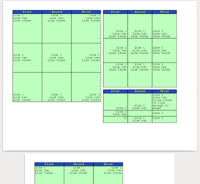

PdfLayoutManager
================
This project is the precursor to [PdfLayoutMgr2](https://github.com/PlanBase/PdfLayoutMgr2)
which adds inline styles, justified text, font loading/caching, and other improvements.
LayoutManager1 may still be updated to ease users transition to LayoutMgr2 by copying the API of similar classes. 
Significant new features will only be supported by LayoutMgr2.

---

LayoutManager1 is a wrapper for PDFBox to add line-breaking, page-breaking, and tables.
It uses a box-model (like HTML) for styles.
Requires PDFBox which in turn requires Log4J or apache commons Logging.



Usage
=====
Example: [TestManualllyPdfLayoutMgr.java](src/test/java/TestManualllyPdfLayoutMgr.java)

API Docs are available from maven central.

I think the character encoding issues in an old (pre 2.0) version of PDFBox have been fixed. So I removed my Transliteration code for Russian which also converted any "High ANSI characters" to lower ANSI equivalents, or to bullets if no equivalent was available. If you get exceptions about character support, you now need to load a font that includes those characters, or trap them yourself. Here's how to load a font: https://pdfbox.apache.org/1.8/cookbook/workingwithfonts.html

Here's how I used to trap them (incomplete and no longer working with the new version of PDFBox):
https://github.com/GlenKPeterson/PdfLayoutManager/blob/master/src/main/java/com/planbase/pdf/layoutmanager/PdfLayoutMgr.java#L892

Maven Dependency
================
```xml
    <dependency>
        <groupId>com.planbase.pdf</groupId>
        <artifactId>PdfLayoutManager</artifactId>
        <version>0.5.4</version>
    </dependency>
```

Building from Source
====================
Requires Maven 3 and Java JDK 1.8+.  Jar file ends up in the `target/` sub-folder.

API documentation can be built with `mvn javadoc:javadoc` and is then found at `target/site/apidocs/index.html`

A sample PDF named `test.pdf` shows up in the root folder of this project when you run `mvn test`.

A jar file can be built with `mvn clean package` and ends up in the `target/` sub-folder.  Or type `mvn clean install` to build and install into your local maven repository.

FAQ
===

***Q: What languages/character sets does PdfLayoutManager support?***

**A:** The PDF spec guarantees support for [WinAnsiEncoding AKA Windows Code Page 1252](http://en.wikipedia.org/wiki/Windows-1252) and maybe four PDType1Fonts fonts without any font embedding.  WinAnsi covers the following languages:

Afrikaans (af), Albanian (sq), Basque (eu), Catalan (ca), Danish (da), Dutch (nl), English (en), Faroese (fo), Finnish (fi), French (fr), Galician (gl), German (de), Icelandic (is), Irish (ga), Italian (it), Norwegian (no), Portuguese (pt), Scottish (gd), Spanish (es), and Swedish (sv)

In addition, PdfLayoutManager uses Romanized substitutions for the Cyrillic characters of the modern Russian (ru) alphabet according to ISO 9:1995 with the following phonetic substitutions: 'Ch' for Ч and 'Shch' for Щ.

This character set is good enough for many purposes. If a character is not supported, it is converted to a bullet, so that the omission is politely, professionally visible.  See: [Transliteration Details](src/main/java/com/planbase/pdf/layoutmanager/PdfLayoutMgr.java#L841)


***Q: I want different fonts and more characters!***

**A:** Fonts that support a wide range of characters tend to be large (over one megabyte). Embedding such a font in every PDF file is unacceptable for most people who have to build PDF files on the fly for users to download, or to send in email. To avoid this, we would have to keep track of what characters are used, then embed an appropriate subset of a font in the resulting PDF.  Different fonts are already divided into subsets, but not necessarily the same subsets.  Almost no font has every character, and it would be your responsibility to provide fonts, and maybe fallback fonts that cover all the characters you might need.

If we supported this, I don't know how much it would slow down PDF creation.  Maybe we'd have a separate project that just maps characters to font fragments.  You'd run that first, then pass the ideally formatted/partitioned output to PdfLayoutManger to use quickly on-the-fly.  Such a solution will require you to do some work and to understand some underlying character/font issues that our current character-set limitations allow us (and you) to ignore.

Last I checked, PDFBox had hard-coded a character encoding that made it difficult for me to work with alternative character encodings. What they did might be correct, but I looked at it, got confused and frustrated, then gave up. Another volunteer started playing with this and gave up too.

That said, this is definitely a solvable problem. There is a broad spectrum of for-profit PDF-producing software. One of the main reasons they can charge money for their products is because this problem is so hard.

**UPDATE 2016-01-20:** PDFBox (which this project is built on top of) 2.0 has Unicode support, which previous versions did not have.  It's currently in Release-Candidate 3.  I haven't had a chance to try it yet.  Here's the fixed issue that I think should make what you want possible: https://issues.apache.org/jira/browse/PDFBOX-922

***Q: I don't want text wrapping.  I just want to set the size of a cell and let it chop off whatever I put in there.***

**A:** PdfLayoutManager was intended to provide html-table-like flowing of text and resizing of cells to fit whatever you put in them, even across multiple pages.  If you don't need that, use PDFBox directly.  If you need other features of PdfLayoutManager, there is a minHeight() setting on table rows.  Combined with padding and alignment, that may get you what you need to layout things that will always fit in the box.

***Q: Will PdfLayoutManager ever support cropping the contents of a fixed-size box?***

**A:** If individual letters or images have a dimension which is bigger than the same dimension of their bounding box, we either have to suppress their display, or crop them.  The PDF spec mentions something about a "clipping path" that might be usable for cropping overflow if you turn it on, render your object, then turn it off again.  I'm not currently aware of PDFBox support for this (if it's even possible).

If the contents are all little things, we could just show as many little letters or images as completely fit, then no more (truncate the list of contents).  Showing none could make truncation work for big objects too, but I'm not in a rush to implement that since it's conceptually so different from the very reason for the existence of PdfLayoutManager.

Maybe some day I'll provide some sample code so you can do truncation yourself.  [TextStyle](src/main/java/com/planbase/pdf/layoutmanager/TextStyle.java) has lineHeight() and stringWidthInDocUnits() that you may find useful for writing your own compatible cropping algorithm.  If you do that (and it works well), I hope you'll consider contributing it back to PdfLayoutManager (at least to this doc) so that others can benefit!

***Q: Why doesn't PdfLayoutManager line-wrap my insanely long single-word test string properly?***

**A:** For text wrapping to work, the text needs occasional whitespace.  In HTML, strings without whitespace do not wrap at all!  In PdfLayoutManager, a long enough string will wrap at some point wider than the cell.

The text wrapping algorithm picks a slightly long starting guess for where to wrap the text, then steps backward looking for whitespace. If it doesn't find any whitspace, it splits the first line at it's original guess length and continues trying to wrap the rest of the text on the next line.

Recent Changes
==============
### 2019-02-13 Version 0.5.4
 - Renamed for clarity, to conform with Java conventions, and to better match LayoutMgr2:
    - XyDim to Dim (still immutable)
        - .x() to .getWidth()
        - .y() to .getHeight()
        - .x(newX) to .withWidth(newX) (returns new immutable Dim)
        - .y(newY) to .withHeight(newY) (returns new immutable Dim)
        - Made constructor public
    - XyOffset to Coord (still immutable)
        - .x() to .getX()
        - .y() to .getY()
        - .x(newX) to .withX(newX) (returns new immutable Coord)
        - .y(newY) to .withY(newY) (returns new immutable Coord)
        - Made constructor public
 - Deleted javadoc from source control.  Should never have put it there.  

### 2019-01-30 Version 0.5.3
 - Renamed static function PdfLayoutMgr.convertJavaStringToWinAnsi() to just .toWinAnsi() and made some changes to it.

### 2019-01-28 Version 0.5.2
 - Changed all floats to doubles.
 By page 120 in a multi-page PDF, the repeated addition of values to the y-coordinate can lead to small but significant rounding errors in floats.
 Also, it just looks cleaner in your IDE (less to typewrite and to read).
 The PDF spec and output still uses floats, but everything is now converted at the latest possible opportunity.
 - Updated PDFBox from 2.0.6 to 2.0.13 for security.
 - Updated minimum Java version from 1.6 to 1.8.
 - Updated TestUtils from 0.0.6 to 0.0.7.

Upgrade Instructions
```
YOU MUST MANUALLY ACCEPT EACH CHANGE!
Colors still use floats, hexidecimal numbers can end in f, and your code may use floats for other reasons!

Replace Regex fix float literals with a decimal point:
([0-9]+)[.]([0-9]+)f
$1.$2

Replace Regex to fix any float literals without a decimal point:
([0-9]+)f
$1.0
OR (if you don't have any float varargs or float array creation)
$1

Replace Words:
Float
Double
```

***Version 0.5.1***
 - Added `CellBuilder.width()`.
 - Made some changes to comply with Bloch's Item 41, "never export two overloadings with the same number of parameters"
     - Changed `CellBuilder.add(Renderable...)` to `CellBuilder.add(Renderable)` (without the varargs).
     - Renamed `CellBuilder.add(String...)` to `CellBuilder.addStrs(String...)`.
     - Broadened type of `CellBuilder.add(List<Renderable>)` and renamed to `CellBuilder.addAll(Collection<? extends Renderable>)`
 - Added some @Override and @inheritDoc annotations.
 - Added `CellStyle.cellBuilder(float width)` to create a builder from a cell style.
 - Changed sign-artifacts phase from verify (which happens before install) to deploy (which happens after)
 - Regenerated JavaDocs.

***Version 0.5.0***
Upgraded to PdfBox 2.0.6 and removed Russian transliteration (because PDF box handles strange characters better).

***Version 0.4.0***
Merged @Kevindum's changes:
 - Custom page sizes: `PdfLayoutMgr.of(PDColorSpace cs, PDRectangle pageSize))`
 - Variable leading: `TextStyle.of(PDType1Font f, float sz, Color tc, float leadingFactor)`
Nice work @Kevindum - thank you!

***Version 0.3.4***
Minimum Java version is now officially 1.6.
Removed main() method in unit test (you can run junit instead).
Added some tests for default values before potentially merging @Kevindum's changes.
Upgraded TestUtils package to 0.0.6.

***Version 0.3.3***
Fixed Padding.of() static constructor issue reported by @enm260 and added unit tests for Padding.
Also slightly changed how Padding.hashCode was calculated.
Building PdfLayoutManager now requires org.organicdesign.testUtils.TestUtils as a test dependency.

***Version 0.3.2***
Added doc.close() inside the PdfLayoutMgr.save() method to ensure we free resources.  Thank you @kbdguy for pointing
this out!  Upgraded PdfBox dependency to 1.8.10.  Possibly figured out how to deploy to Nexus Sonatype so you don't
have to build from source any more!

***Version 0.3.1***
Upgraded PdfBox dependency to 1.8.9

**2015-03-14 Portrait Orientation**
***Version 0.3.0-SNAPSHOT***
Added Portrait page orientation (previously only Landscape was available).  Orientation applies to a LogicalPage
(a grouping of similar pages) so that you can switch mid-document.  Public methods were moved from PdfLayoutMgr to
LogicalPage in order for this to work: pageMgr(), yPageTop(), yPageBottom(), and pageWidth(). Now you must call
them *after* LogicalPage lp = pageMgr.logicalPageStart(); Also added some comments and fixed others.  Because this
changes the API, I bumped up the middle version number.  Thank you @EricHans76 for requesting this feature.

***Version 0.2.2***
Fixed misleading use of package-scoped method in the example/test.  Thank you @wienczny

Version 0.2.1: Built with JDK 1.6.0_45 to ensure backward compatibility (Maven 3 wouldn't run with 1.5.0_22).
Made a few classes private and updated the JavaDocs.  Thank you @peterdietz

Version 0.2: Added true table builder classes, a cascade of styles from Document to LogicalPage to Renderable/Cell/Table, etc.
Tables have Parts (which you probably will define as a head and body with appropriate styles and column widths).
TableParts have Rows, Rows have Cells.
Cells are also Renderable and available outside of Tables, analogous to the HTML box-model, but without "margins" only padding and borders.
Also added PNG image support.

Version 0.1.1: Added run-time check for appropriate data types used to create a Cell to provide fail-fast behavior for
client code - if you pass an invalid object type, it throws an exception immediately instead of waiting to purge the cache.

Version 0.1: Initial working and documented version

Intended API Changes
====================
Be a little more careful about making things inside the PdfLayoutMgr class private.  Some older code in there is working
and needs a cleanup before this can happen.  If users follow the sample code in test/java/TestManualllyPdfLayoutMgr and don't
try accessing default/package-scoped methods, they should not need to make any changes when this cleanup happens.

 - Consider rapping checked exceptions for functional programmers.

License
=======
Copyright 2015 PlanBase Inc. and Glen Peterson

Licensed under the Apache License, Version 2.0 (the "License");
you may not use this file except in compliance with the License.
You may obtain a copy of the License at

http://www.apache.org/licenses/LICENSE-2.0

Unless required by applicable law or agreed to in writing, software
distributed under the License is distributed on an "AS IS" BASIS,
WITHOUT WARRANTIES OR CONDITIONS OF ANY KIND, either express or implied.
See the License for the specific language governing permissions and
limitations under the License.
